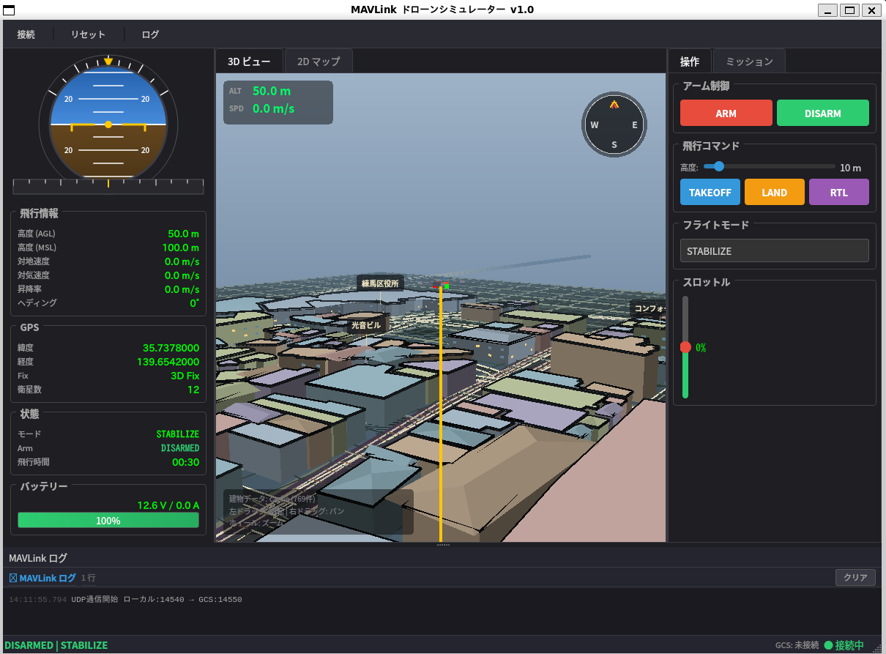

# MAVLink ドローンシミュレーター

C++ / Qt5 / MAVLink によるドローンのソフトウェアシミュレーター。

練馬駅周辺を初期位置とし、MAVLinkテレメトリ、ミッション飛行、2D/3D表示を備えたデスクトップアプリです。
3Dビューでは OpenStreetMap / Overpass API から取得した建物、道路、線路を表示し、取得できない場合は同梱サンプル地形にフォールバックします。



## 主な機能

- MAVLink UDP通信（QGroundControl 連携）
- ARM / DISARM / TAKEOFF / LAND / RTL / フライトモード変更
- 姿勢・GPS・速度・バッテリーなどのテレメトリ表示
- 2Dマップと3Dビューの切り替え
- 現在地からの相対位置で指定するミッションウェイポイント
- OSM建物データの取得、ローカルキャッシュ、サンプルフォールバック
- 建物の押し出し表示、屋根形状、道路/線路、窓・屋上ディテールの簡易表現
- 地面の色むら、道路の端線・センター破線・横断歩道の簡易表現

初期位置:

- 北緯 `35.7378`
- 東経 `139.6542`
- 初期高度 `50m AGL`

## ビルドと起動

```bash
# ビルド
mkdir -p build && cd build
cmake ..
make -j$(nproc)

# 起動
./MAVLink_sim
```

---

## 画面構成

```
┌─────────────────────────────────────────────────────────────┐
│  ツールバー: [🔌 接続] [🔄 リセット]                        │
├──────────────────┬─────────────────────┬────────────────────┤
│  左パネル        │  中央パネル          │  右パネル           │
│                  │                     │                    │
│  ■ 姿勢表示      │  ■ 3Dビュー / 2Dマップ│  ■ アーム制御       │
│   (人工水平儀)   │   ・ドローン位置     │   [ARM] [DISARM]   │
│   ・ロール/ピッチ │   ・飛行経路トレース  │                    │
│   ・ヘディング    │   ・OSM建物/道路/線路 │  ■ 飛行コマンド    │
│                  │   ・回転/ズーム/パン   │   高度: [スライダ]  │
│  ■ テレメトリ     │                     │   [TAKEOFF]        │
│   ・高度 (AGL/MSL)│                     │   [LAND] [RTL]     │
│   ・速度         │                     │                    │
│   ・GPS座標      │                     │  ■ フライトモード   │
│   ・衛星数       │                     │   [コンボボックス]   │
│   ・バッテリー    │                     │                    │
│   ・飛行時間     │                     │  ■ ミッション       │
│                  │                     │   [縦スライダ]      │
├──────────────────┴─────────────────────┴────────────────────┤
│  ステータスバー: [DISARMED | STABILIZE]     [● 接続中]       │
└─────────────────────────────────────────────────────────────┘
```

---

## 操作方法

### 基本フロー: 離陸 → 飛行 → 着陸

| 手順 | 操作 | 説明 |
|------|------|------|
| 1 | **ARM ボタン** をクリック | ドローンをアーム（モーター起動準備） |
| 2 | **高度スライダー** で離陸高度を設定 | 2m ～ 100m の範囲 |
| 3 | **TAKEOFF ボタン** をクリック | 設定高度まで自動上昇 |
| 4 | 飛行中の操作（下記参照） | 手動操作 or GUIDEDモード |
| 5 | **LAND ボタン** をクリック | 現在位置で着陸 |

### 飛行中の操作

| 操作 | 方法 |
|------|------|
| **スロットル** | 右パネルの縦スライダーを上下 → 高度変更 |
| **RTL (帰還)** | RTL ボタン → ホームポジションに自動帰還後、着陸 |
| **モード変更** | コンボボックスから選択 |

### フライトモード一覧

| モード | 説明 |
|--------|------|
| **STABILIZE** | 手動操作モード。スロットルで高度制御 |
| **GUIDED** | 指定位置に自動移動 |
| **AUTO** | ミッション自動飛行 |
| **LOITER** | その場でホバリング |
| **RTL** | ホームに自動帰還 |
| **LAND** | 現在位置で着陸 |

### マップ操作

| 操作 | 方法 |
|------|------|
| **3D回転** | 左ドラッグ |
| **3Dパン（移動）** | 右ドラッグ |
| **2Dパン（移動）** | マウスドラッグ |
| **ズーム** | マウスホイール |
| **トレースクリア** | ツールバーの 🔄 リセット |

### ミッション

ミッションのウェイポイントは緯度経度の絶対値ではなく、現在地からの相対位置で指定します。

| 入力 | 説明 |
|------|------|
| **北方向** | 現在地から北へ何m進むか |
| **東方向** | 現在地から東へ何m進むか |
| **高度** | 目標高度 (m AGL) |

例: `北方向 100m / 東方向 50m / 高度 40m` は、実行時点のドローン現在地から北へ100m、東へ50m、高度40mへ移動します。複数ウェイポイントを並べた場合、各ウェイポイントは前の到達位置からの相対移動として解釈されます。

### 3Dビュー

3Dビューでは以下を描画します:

- ドローンモデル、影、高度ライン、飛行トレース
- ミッション経路とウェイポイント
- OSM由来の建物フットプリントの3D押し出し
- 道路・線路の地表表現
- 道路の端線、センター破線、横断歩道
- 簡易的な窓、屋上縁取り、屋根形状、建物色分け
- 地面の色むらと区画境界風ライン

建物データはローカルキャッシュを優先し、未取得の場合は Overpass API から半径300mの建物・道路・線路を取得します。API取得に失敗した場合は `resources/buildings/nerima_sample.json` のサンプル表示に戻ります。

### ツールバー

| ボタン | 機能 |
|--------|------|
| 🔌 接続 | UDP接続を再接続 |
| 🔄 リセット | シミュレーションを初期状態にリセット |

---

## QGroundControl との接続

1. このシミュレーターを起動（ポート `14550` で MAVLink を送信）
2. QGroundControl を起動
3. 自動的に Vehicle として認識される
4. QGC 側から Arm / Takeoff / コマンド送信が可能

**通信ポート**: UDP `14550` (localhost)

---

## テレメトリ表示

左パネルに以下の情報がリアルタイム表示されます:

- **高度**: AGL（対地）/ MSL（海抜）
- **速度**: 対地速度 / 対気速度
- **昇降率**: m/s（正=上昇、負=降下）
- **ヘディング**: 0° = 北
- **GPS**: 緯度 / 経度 / Fix状態 / 衛星数
- **バッテリー**: 電圧(V) / 電流(A) / 残量(%)
  - 約20分で消耗（シミュレーション）
  - 50%以下: 黄色、20%以下: 赤
- **飛行時間**: 起動からの経過時間

---

## 人工水平儀（Attitude Indicator）

- **青い部分**: 空（上方向）
- **茶色い部分**: 地面（下方向）
- **白い水平線**: 水平基準
- **黄色い三角**: ロール角ポインタ
- **黄色い翼マーク**: 機体の基準
- **下部のバー**: ヘディング表示 (N/E/S/W)
